# Summary of 3_Linear

[<< Go back](../README.md)

## Logistic Regression (Linear)
- **n_jobs**: -1
- **explain_level**: 2

## Validation
 - **validation_type**: split
 - **train_ratio**: 0.75
 - **shuffle**: True
 - **stratify**: True

## Optimized metric
logloss

## Training time

3.3 seconds

## Metric details
|           |    score |   threshold |
|:----------|---------:|------------:|
| logloss   | 0.547193 |  nan        |
| auc       | 0.691339 |  nan        |
| f1        | 0.844776 |    0.462383 |
| accuracy  | 0.748792 |    0.462383 |
| precision | 0.905882 |    0.875297 |
| recall    | 1        |    0.150823 |
| mcc       | 0.281031 |    0.734517 |

## Metric details with threshold from accuracy metric
|           |    score |   threshold |
|:----------|---------:|------------:|
| logloss   | 0.547193 |  nan        |
| auc       | 0.691339 |  nan        |
| f1        | 0.844776 |    0.462383 |
| accuracy  | 0.748792 |    0.462383 |
| precision | 0.766938 |    0.462383 |
| recall    | 0.940199 |    0.462383 |
| mcc       | 0.256383 |    0.462383 |

## Confusion matrix (at threshold=0.462383)
|              |   Predicted as 0 |   Predicted as 1 |
|:-------------|-----------------:|-----------------:|
| Labeled as 0 |               27 |               86 |
| Labeled as 1 |               18 |              283 |

## Learning curves
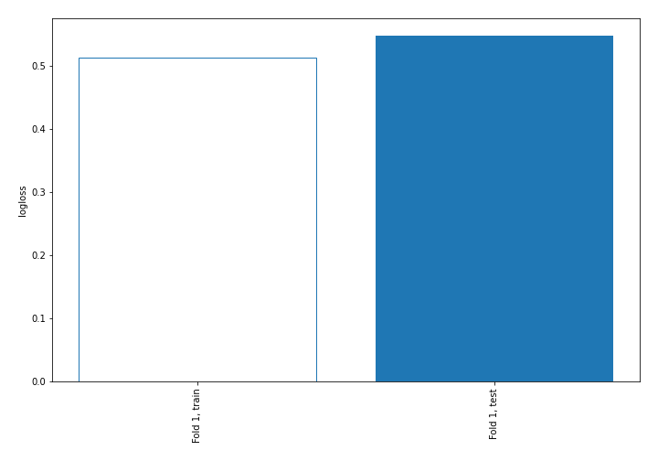

## Coefficients
| feature     |   Learner_1 |
|:------------|------------:|
| intercept   |    1.10005  |
| Teenhome    |    0.398884 |
| Recency     |    0.344104 |
| Kidhome     |    0.103214 |
| Education   |   -0.078318 |
| Dt_Customer |   -0.325956 |
| Income      |   -0.719528 |

## Permutation-based Importance
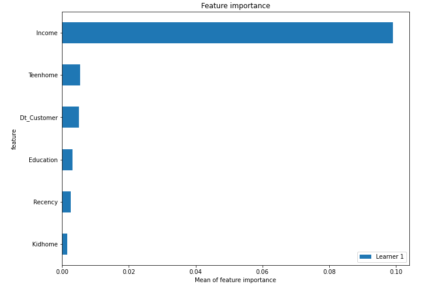
## Confusion Matrix

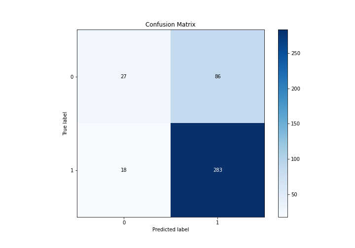

## Normalized Confusion Matrix

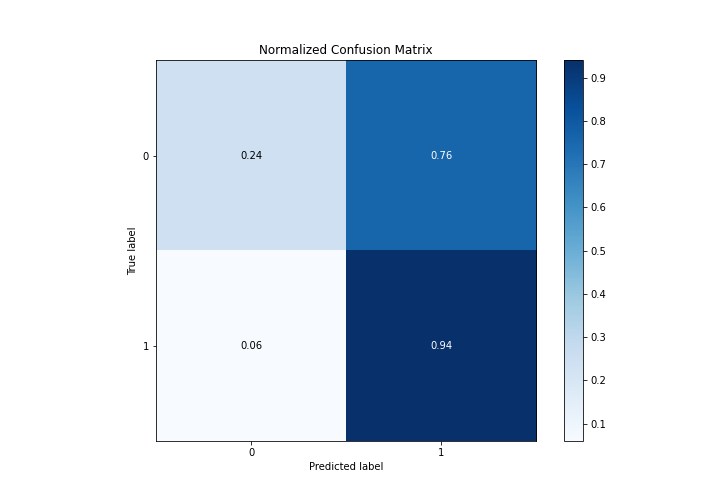

## ROC Curve

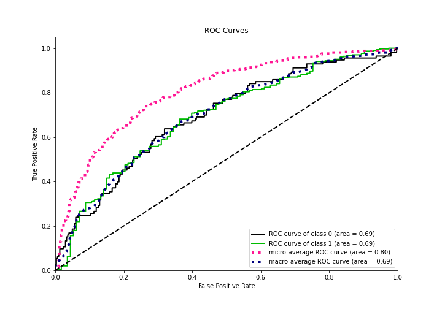

## Kolmogorov-Smirnov Statistic

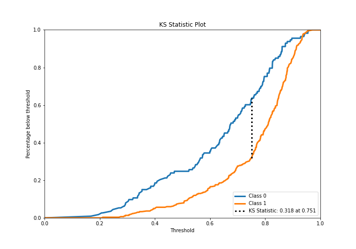

## Precision-Recall Curve

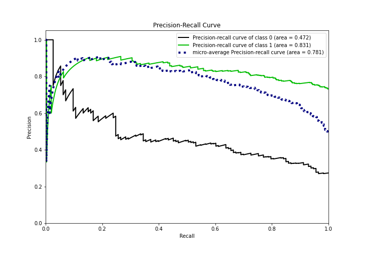

## Calibration Curve

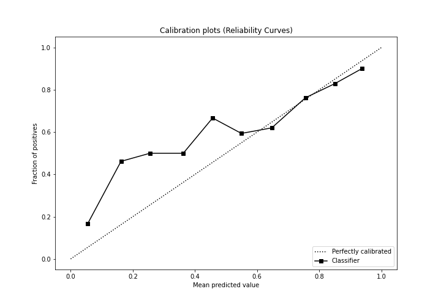

## Cumulative Gains Curve

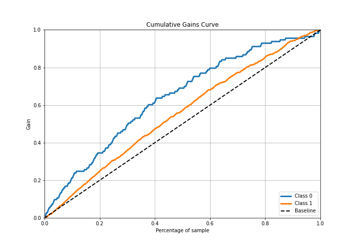

## Lift Curve

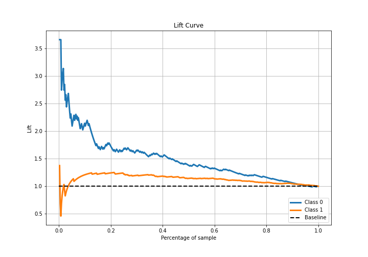

## SHAP Importance
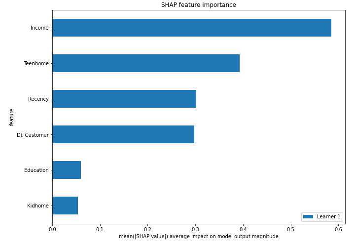

## SHAP Dependence plots

### Dependence (Fold 1)
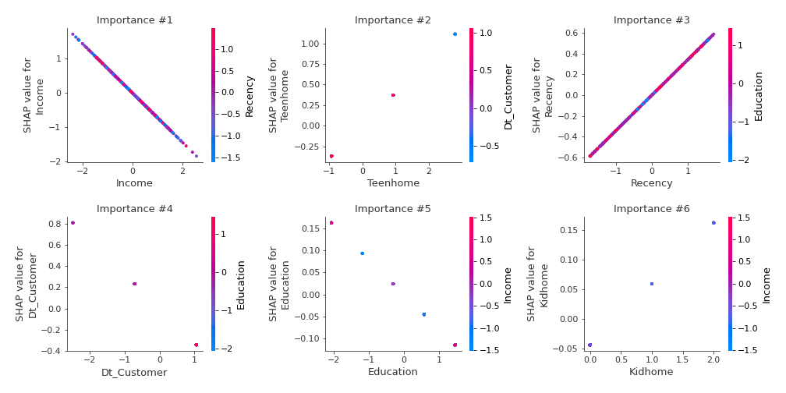

## SHAP Decision plots

### Top-10 Worst decisions for class 0 (Fold 1)
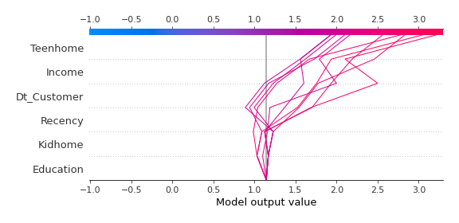
### Top-10 Best decisions for class 0 (Fold 1)
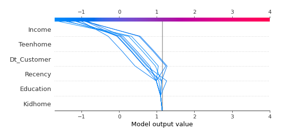
### Top-10 Worst decisions for class 1 (Fold 1)
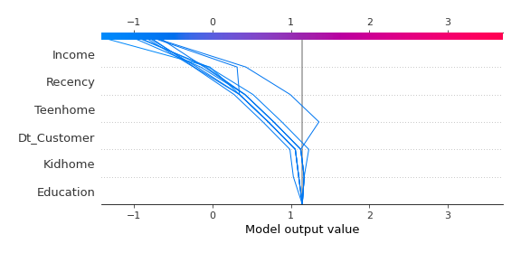
### Top-10 Best decisions for class 1 (Fold 1)
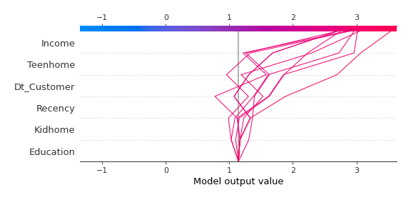

[<< Go back](../README.md)
