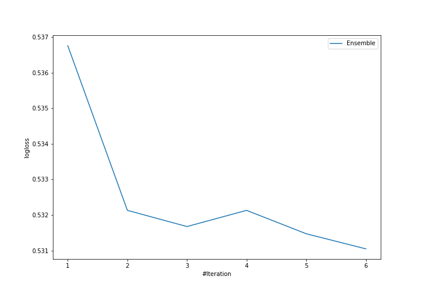
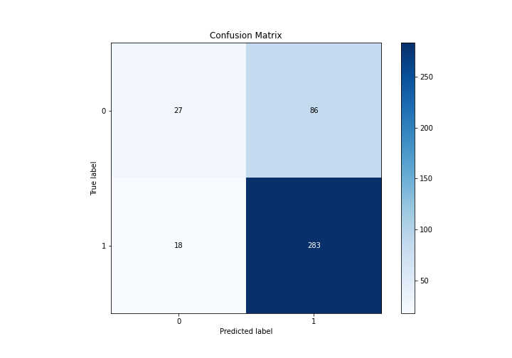
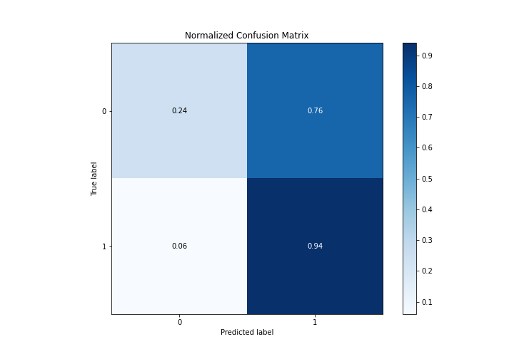
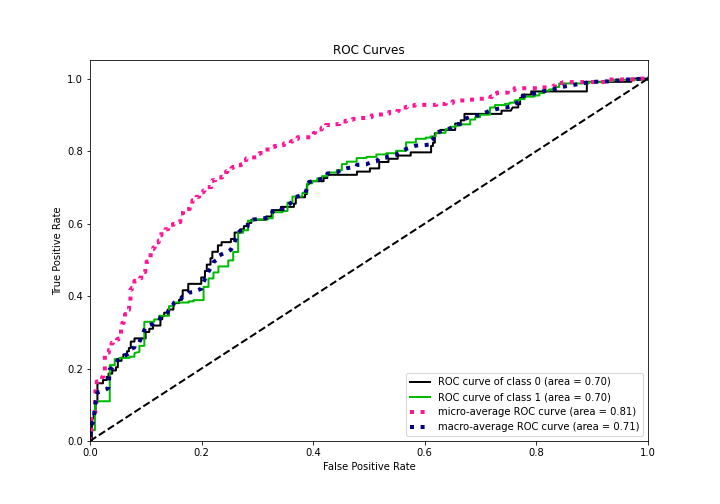
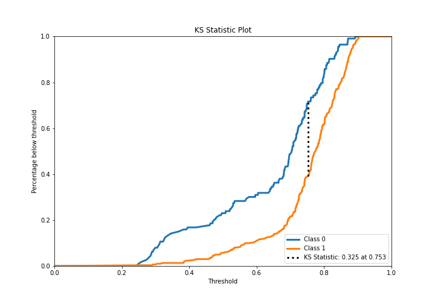
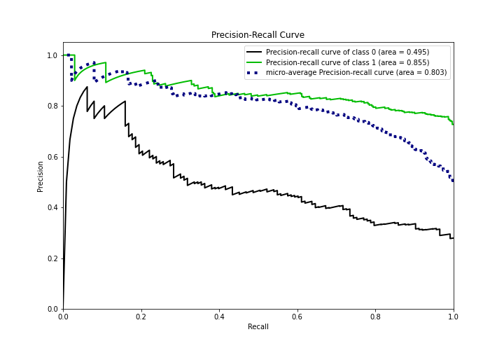
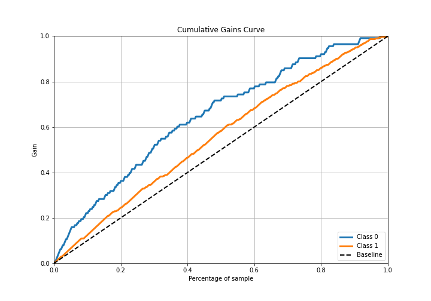
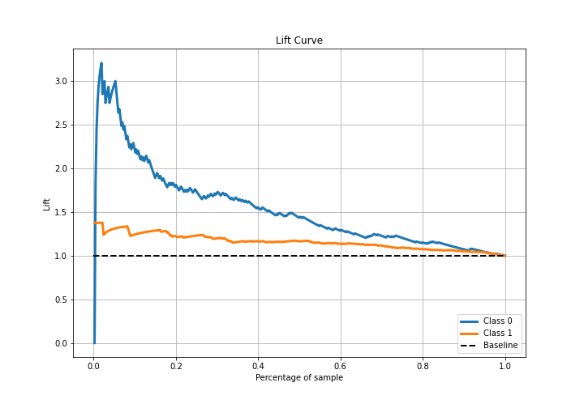

# Summary of Ensemble

[<< Go back](../README.md)

## Ensemble structure
| Model                   |   Weight |
|:------------------------|---------:|
| 1_Baseline              |        1 |
| 5_Default_NeuralNetwork |        2 |
| 6_Default_RandomForest  |        3 |

## Metric details
|           |    score |   threshold |
|:----------|---------:|------------:|
| logloss   | 0.531047 |  nan        |
| auc       | 0.703746 |  nan        |
| f1        | 0.845238 |    0.504588 |
| accuracy  | 0.748792 |    0.51512  |
| precision | 0.964286 |    0.873373 |
| recall    | 1        |    0.21927  |
| mcc       | 0.296124 |    0.718021 |

## Metric details with threshold from accuracy metric
|           |    score |   threshold |
|:----------|---------:|------------:|
| logloss   | 0.531047 |   nan       |
| auc       | 0.703746 |   nan       |
| f1        | 0.844776 |     0.51512 |
| accuracy  | 0.748792 |     0.51512 |
| precision | 0.766938 |     0.51512 |
| recall    | 0.940199 |     0.51512 |
| mcc       | 0.256383 |     0.51512 |

## Confusion matrix (at threshold=0.51512)
|              |   Predicted as 0 |   Predicted as 1 |
|:-------------|-----------------:|-----------------:|
| Labeled as 0 |               27 |               86 |
| Labeled as 1 |               18 |              283 |

## Learning curves

## Confusion Matrix

## Normalized Confusion Matrix

## ROC Curve

## Kolmogorov-Smirnov Statistic

## Precision-Recall Curve

## Calibration Curve

## Cumulative Gains Curve

## Lift Curve

[<< Go back](../README.md)
